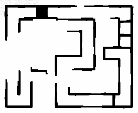

# RAICOM 智能侦察项目技术报告

## 摘要

本项目面向 RAICOM 智能侦察仿真任务，基于 Ubuntu、ROS1 Noetic、
Gazebo Classic 和 Python 实现四轮麦克纳姆机器人仿真系统。系统包含
自定义 URDF/Xacro 机器人、全向底盘控制、激光与视觉传感器、固定边界
栅格建图、AMCL 定位、move_base 自主导航、多点巡检、YOLO ONNX
敌军/友军/人质识别以及任务证据记录。

机器人按照 `navigation_params.yaml` 中的 12 个目标点完成场地扫描和
巡检。当前最终地图分辨率约 0.02m，地图尺寸为 295 × 245，原点为
(-0.7, -4.2)。建图入口默认执行 3 圈巡航，以增加墙体观测次数。

## 1. 任务理解

比赛任务要求机器人在 5m × 4m 仿真场地内完成：

1. 基于激光雷达进行场地建图；
2. 使用自主导航依次到达多个巡检点；
3. 在两个识别区识别敌军、友军和人质数量；
4. 在终端或 ROS 话题中输出识别结果；
5. 保存地图、轨迹、状态、识别截图和任务总结。

系统设计遵循接口稳定原则，主入口、话题和参数路径保持固定，算法模块
通过参数切换，便于比赛现场调试。

## 2. 系统总体架构

```text
Gazebo 世界与机器人模型
  ├─ /odom、odom -> base_footprint
  ├─ /scan -> /scan_filtered
  ├─ /camera/image_raw
  ├─ /imu/data
  └─ /joint_states
        ↓
建图：odom_laser_mapper -> /map
导航：map_server + AMCL + move_base
巡检：move_base_waypoint_navigator
识别：battlefield_recognition
记录：task_evidence_recorder
```

主要软件模块位于 `src/myrobot_description/`：

| 模块 | 文件 |
|---|---|
| 机器人模型 | `urdf/turtlebot3_mecanum.urdf.xacro` |
| Gazebo 场景 | `worlds/rm_map.world` |
| 麦克纳姆仿真接口 | `scripts/mecanum_sim_driver.py` |
| 建图 | `scripts/odom_laser_mapper.py` |
| 导航巡点 | `scripts/move_base_waypoint_navigator.py` |
| 图像识别 | `scripts/battlefield_recognition.py` |
| 证据记录 | `scripts/task_evidence_recorder.py` |

## 3. 机器人模型与麦克纳姆运动

机器人使用四个麦克纳姆轮，底盘控制量为：

```text
vx：前后速度
vy：横移速度
wz：原地旋转角速度
```

四轮逆运动学形式为：

```text
左前轮 = (vx - vy - (L + W)wz) / r
右前轮 = (vx + vy + (L + W)wz) / r
左后轮 = (vx + vy - (L + W)wz) / r
右后轮 = (vx - vy + (L + W)wz) / r
```

其中 `r` 为轮半径，`L`、`W` 分别为半轴距和半轮距。项目导航控制采用
“纯平移、停稳、原地转向”策略，移动时 `angular.z=0`，避免边走边转
造成拐角振荡。

## 4. SLAM 建图

### 4.1 问题分析

传统 gmapping 在本场地的长直、重复走廊中可能产生错误 scan matching
修正，表现为地图旋转、重影、假闭环和画布异常膨胀。Gazebo 平面驱动
已经提供接近真值的里程计，因此项目默认采用仿真专用建图后端。

### 4.2 建图算法

`odom_laser_mapper.py` 使用 `odom -> base_scan` 的 TF 将激光回波投影到
固定栅格：

1. Bresenham 射线经过位置更新为空闲区域；
2. 有限激光端点更新为占据区域；
3. 无回波不向场地外延伸；
4. 使用 3 × 3 闭运算连接一像素墙缝；
5. 删除面积小于 8 个栅格的孤立噪点；
6. 固定地图范围和分辨率，避免动态画布膨胀。

传统 gmapping 仍可通过以下命令用于对照：

```bash
roslaunch myrobot_description slam_mapping.launch mapping_backend:=gmapping
```

### 4.3 建图结果

| 指标 | 结果 |
|---|---:|
| 地图尺寸 | 295 × 245 |
| 分辨率 | 约 0.02m |
| 原点 | (-0.7, -4.2) |
| 单圈导航目标 | 12 |
| 默认建图巡航 | 3 圈 |
| 导航地图 | `raicom_slam_map_final.yaml` |

最终地图：

```text
src/myrobot_description/maps/raicom_slam_map_final.pgm
src/myrobot_description/maps/raicom_slam_map_final.yaml
```



## 5. 自主导航与巡检

导航链路由 `map_server + AMCL + move_base` 构成。目标点保存在
`config/navigation_params.yaml`。自定义巡点节点首先调用 Navfn 获取全局
路径，再使用全向路径跟随器输出 `linear.x` 和 `linear.y`。到达位置容差
后持续确认多个周期，随后停车并单独执行角度调整。

该策略具有以下特点：

- 支持麦克纳姆横移；
- 不在平移时旋转；
- 到点判定包含稳定周期，避免提前跳到下一点；
- 支持失败重试和代价地图清理；
- 通过 `/navigation_status` 发布结构化 JSON 状态。

## 6. 兵人图像识别

### 6.1 当前识别流程

```text
到达识别点并停稳
  -> 获取 /camera/image_raw
  -> 裁剪有效视野
  -> YOLO ONNX 整帧检测
  -> 宽画面重叠分块
  -> 同类 NMS 去重
  -> 统计 enemy/friendly/hostage
  -> 保存原图与标注图
```

模型输入尺寸为 640 × 640。对于横向较宽的相机画面，节点会同时执行
整帧与重叠分块推理，避免多个远处目标缩小后漏检。

### 6.2 正式权重

正式模型文件：

```text
src/myrobot_description/recognition_weights/best.pt
src/myrobot_description/recognition_weights/best.onnx
```

配置示例：

```yaml
recognition_backend: yolo_onnx
recognition_weights: recognition_weights/best.onnx
recognition_model_input_size: [640, 640]
recognition_model_confidence: 0.50
recognition_yolo_class_names: [renzhi, youjun, dijun]
```

类别映射为 `renzhi -> hostage`、`youjun -> friendly`、
`dijun -> enemy`。功能包携带 Python 3.8 CPU ONNX Runtime，运行时
不要求安装 PyTorch 或新版 OpenCV。

## 7. 数据记录与可复现性

任务运行后自动记录：

```text
trajectory.csv
recognition_results.jsonl
patrol_status.jsonl
mission_summary.md
recognition_frames/*_raw.jpg
recognition_frames/*_annotated.jpg
```

默认目录为：

```text
~/.ros/myrobot_description_logs/
```

识别 JSON 包含区域、类别计数、机器人位姿、检测明细、后端模式、证据
图片路径和期望计数，便于答辩时追溯。

## 8. 测试与验收

静态和构建测试：

```bash
catkin_make
python3 -m py_compile src/myrobot_description/scripts/*.py
rosrun myrobot_description static_workspace_check.py
```

运行测试：

```bash
roslaunch myrobot_description slam_mapping.launch
roslaunch myrobot_description autonomous_navigation.launch
roslaunch myrobot_description task_patrol.launch
```

关键验收话题：

```bash
rostopic echo /map/info -n 1
rostopic echo /navigation_status
rostopic echo /recognition_result
rostopic echo /recognition_summary
```

## 9. 创新点

1. 针对仿真重复走廊设计固定边界里程计激光建图，避免 gmapping 假闭环；
2. 麦克纳姆导航采用全向平移与原地转向解耦控制；
3. YOLO 整帧与重叠分块推理兼顾单目标和宽画面多目标；
4. 建图、导航、识别和证据日志形成完整可追溯任务链。

## 10. 后续工作

- 增加亮度、视角和遮挡增强，提高识别鲁棒性；
- 增加独立测试集混淆矩阵、准确率和召回率；
- 根据比赛现场机器性能调整模型尺寸和推理频率。

## 11. 演示命令

```bash
cd /root/workspace/rui/rui/practice_ws
source /opt/ros/noetic/setup.bash
catkin_make
source devel/setup.bash
roslaunch myrobot_description task_patrol.launch
```
