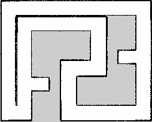

# RAICOM 智能侦察项目技术报告

## 摘要

本项目面向 RAICOM 智能侦察仿真任务，基于 Ubuntu、ROS1 Noetic、
Gazebo Classic 和 Python 实现四轮麦克纳姆机器人仿真系统。系统包含
自定义 URDF/Xacro 机器人、全向底盘控制、激光与视觉传感器、
`slam_toolbox` 建图、AMCL 定位、move_base 自主导航、多点巡检、YOLO ONNX
敌军/友军/人质识别以及任务证据记录。

机器人正式巡检按照 `navigation_params.yaml` 中的 `zone_1`、
`right_wall_exit`、`zone_2`、`finish` 4 个目标点执行；建图阶段使用
`slam_navigation_params.yaml` 中的 12 个覆盖点完成场地扫描。当前默认
SLAM 后端为 `slam_toolbox`，使用 `/scan_filtered`、
`/odom` 和 TF 做稳定高分辨率建图。仓库保留的导航地图分辨率约 0.02m，地图尺寸为 254 × 204，
原点约为 (-0.289, -3.790)。

## 1. 任务理解

比赛任务要求机器人在 5m × 4m 仿真场地内完成：

1. 基于激光雷达进行场地建图；
2. 使用自主导航依次到达多个巡检点；
3. 在两个识别区识别敌军、友军和人质数量；
4. 在终端或 ROS 话题中输出识别结果；
5. 保存地图、轨迹、状态、识别截图和任务总结。

系统设计遵循接口稳定原则，主入口、话题和参数路径保持固定，算法模块
通过参数切换，便于比赛现场调试。

## 2. 系统总体架构

```text
Gazebo 世界与机器人模型
  ├─ /odom、odom -> base_footprint
  ├─ /scan -> /scan_filtered
  ├─ /camera/image_raw
  ├─ /imu/data
  └─ /joint_states
        ↓
建图：slam_toolbox -> /map（默认）；odom_laser_mapper -> /map（备用）
导航：map_server + AMCL + move_base
巡检：move_base_waypoint_navigator
识别：battlefield_recognition
记录：task_evidence_recorder
```

主要软件模块位于 `src/` 下的功能包：

| 模块 | 文件 |
|---|---|
| 机器人模型 | `myrobot_description/urdf/turtlebot3_mecanum.urdf.xacro` |
| Gazebo 场景 | `myrobot_description/worlds/rm_map.world` |
| 麦克纳姆仿真接口 | `myrobot_simulation/scripts/mecanum_sim_driver.py` |
| 默认建图 | `slam_toolbox`（ROS 包） |
| 备用建图 | `myrobot_navigation/scripts/odom_laser_mapper.py` |
| 导航巡点 | `myrobot_navigation/scripts/move_base_waypoint_navigator.py` |
| 图像识别 | `myrobot_recognition/scripts/battlefield_recognition.py` |
| 证据记录 | `myrobot_task/scripts/task_evidence_recorder.py` |

## 3. 机器人模型与麦克纳姆运动

机器人使用四个麦克纳姆轮，底盘控制量为：

```text
vx：前后速度
vy：横移速度
wz：原地旋转角速度
```

四轮逆运动学形式为：

```text
左前轮 = (vx - vy - (L + W)wz) / r
右前轮 = (vx + vy + (L + W)wz) / r
左后轮 = (vx + vy - (L + W)wz) / r
右后轮 = (vx - vy + (L + W)wz) / r
```

其中 `r` 为轮半径，`L`、`W` 分别为半轴距和半轮距。正式巡航由
`move_base` 调用 GlobalPlanner 和 TebLocalPlannerROS 闭环求解速度，允许横移与转向
同时发生；建图阶段仍可使用低速直控巡航来积累观测。

## 4. SLAM 建图

### 4.1 问题分析

传统 gmapping 在本场地的长直、重复走廊中可能产生错误 scan matching
修正，表现为地图旋转、重影、假闭环和画布异常膨胀。项目现在默认采用
`odom_laser`（备用后端），结合里程计、过滤激光、固定场地边界和轴线投影生成稳定栅格图。

### 4.2 建图算法

`odom_laser`（备用后端）使用 `/odom`、TF 和 `/scan_filtered` 激光建立 2D 栅格图：

1. 自动建图巡航在 `odom` 坐标系下低速直控走完覆盖点；
2. `scan_self_filter.py` 生成 `/scan_filtered`，去掉车体近场回波；
3. `odom_laser_mapper.py` 按里程计位姿把激光命中写入 0.02m 栅格；
4. 根据规则场地的水平/垂直边界做轴线过滤、合并和补线；
5. 发布 `/map`，供 RViz 查看并由 `save_slam_map.launch` 保存；
6. `slam_toolbox`（默认）与 `gmapping` 保留为对比后端。

仿真专用固定边界 mapper 和传统 gmapping 仍可作为对照：

```bash
roslaunch myrobot_navigation slam_mapping.launch mapping_backend:=odom_laser
roslaunch myrobot_navigation slam_mapping.launch mapping_backend:=gmapping
```

### 4.3 建图结果

| 指标 | 结果 |
|---|---:|
| 默认后端 | slam_toolbox |
| 地图尺寸 | 254 × 204 |
| 分辨率 | 约 0.02m |
| 原点 | 约 (-0.289, -3.790) |
| 建图单圈目标 | 12 |
| 正式巡航目标 | 4 |
| 默认建图巡航 | 1 圈 |
| 回环优化 | 对比后端可用，默认不依赖 |
| 导航地图 | `raicom_slam_map_one_lap_test.yaml` |

最终地图：

```text
src/myrobot_navigation/maps/raicom_slam_map_one_lap_test.pgm
src/myrobot_navigation/maps/raicom_slam_map_one_lap_test.yaml
```



## 5. 自主导航与巡检

导航链路由 `map_server + AMCL + move_base` 构成。正式目标点保存在
`config/navigation_params.yaml`。自定义巡点节点只负责按顺序发送
`move_base` action goal，路径和速度由 GlobalPlanner 与 TebLocalPlannerROS
共同求解，平移和转向可以同时发生。

该策略具有以下特点：

- 支持麦克纳姆横移；
- 平移和转向由局部规划器同时优化；
- 到点判定包含稳定周期，避免提前跳到下一点；
- 支持失败重试和代价地图清理；
- 通过 `/navigation_status` 发布结构化 JSON 状态。

## 6. 兵人图像识别

### 6.1 当前识别流程

```text
到达识别点并停稳
  -> 获取 /camera/image_raw
  -> 裁剪有效视野
  -> YOLO ONNX 整帧检测
  -> 宽画面重叠分块
  -> 同类 NMS 去重
  -> 统计 enemy/friendly/hostage
  -> 保存原图与标注图
```

模型输入尺寸为 640 × 640。对于横向较宽的相机画面，节点会同时执行
整帧与重叠分块推理，避免多个远处目标缩小后漏检。

### 6.2 正式权重

正式模型文件：

```text
src/myrobot_recognition/recognition_weights/best.pt
src/myrobot_recognition/recognition_weights/best.onnx
```

配置示例：

```yaml
recognition_backend: yolo_onnx
recognition_weights: recognition_weights/best.onnx
recognition_model_input_size: [640, 640]
recognition_model_confidence: 0.50
recognition_yolo_class_names: [renzhi, youjun, dijun]
```

类别映射为 `renzhi -> hostage`、`youjun -> friendly`、
`dijun -> enemy`。功能包携带 Python 3.8 CPU ONNX Runtime，运行时
不要求安装 PyTorch 或新版 OpenCV。

## 7. 数据记录与可复现性

任务运行后自动记录：

```text
trajectory.csv
recognition_results.jsonl
patrol_status.jsonl
mission_summary.md
recognition_frames/*_raw.jpg
recognition_frames/*_annotated.jpg
```

默认目录为：

```text
~/.ros/myrobot_description_logs/
```

识别 JSON 包含区域、类别计数、机器人位姿、检测明细、后端模式、证据
图片路径和期望计数，便于答辩时追溯。

## 8. 测试与验收

静态和构建测试：

```bash
catkin_make
python3 -m py_compile src/myrobot_navigation/scripts/*.py src/myrobot_task/scripts/*.py src/myrobot_recognition/scripts/*.py src/myrobot_simulation/scripts/*.py
rosrun myrobot_task static_workspace_check.py
```

运行测试：

```bash
roslaunch myrobot_navigation slam_mapping.launch
roslaunch myrobot_navigation autonomous_navigation.launch
roslaunch myrobot_task task_patrol.launch
```

关键验收话题：

```bash
rostopic echo /map/info -n 1
rostopic echo /navigation_status
rostopic echo /recognition_result
rostopic echo /recognition_summary
```

## 9. 创新点

1. 将默认建图切换为 `slam_toolbox` 稳定建图，适配仿真场地并降低地图重影；
2. 麦克纳姆正式巡航采用 TEB 全向局部规划，平移与转向联合优化；
3. YOLO 整帧与重叠分块推理兼顾单目标和宽画面多目标；
4. 建图、导航、识别和证据日志形成完整可追溯任务链。

## 10. 后续工作

- 录制 rosbag 后离线比较 `slam_toolbox`、`odom_laser` 和 `gmapping` 的地图误差；
- 增加自动地图质量评分，例如边界完整度、走廊误占据率和闭环残差；
- 根据比赛现场机器性能调整 `odom_laser` 轴线过滤阈值，并保留 `slam_toolbox` 离线对比；
- 增加独立识别测试集混淆矩阵、准确率和召回率。

## 11. 演示命令

```bash
cd /home/chen/ros1_ultrasound_ws/rui/rui/practice_ws
source /opt/ros/noetic/setup.bash
catkin_make
source devel/setup.bash
roslaunch myrobot_task task_patrol.launch
```
